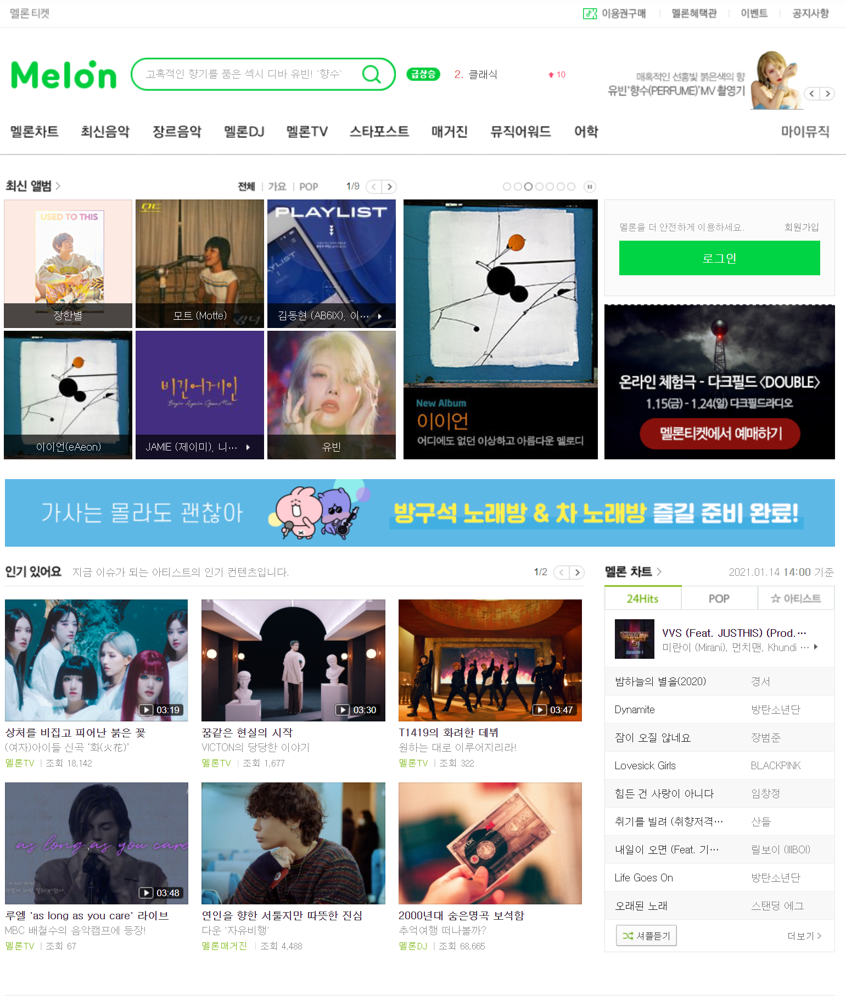
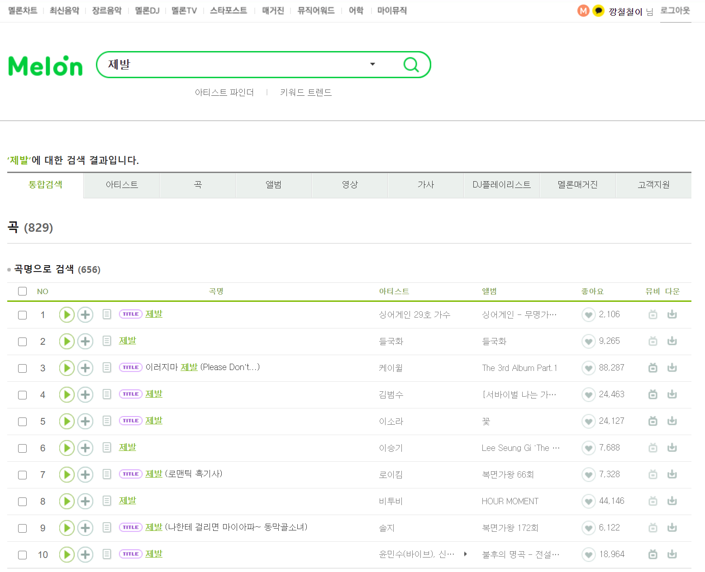

# Toy Project - JSP로 서버프로그램 구현

 
 

## 모방해 볼 사이트의 대략적인 page

 

### 메인 page

##### 메인 page 구현 예정

- header
- login
- 최신 앨범
- 최신 뮤비

</img>

 
 

### 회원가입 page

##### 회원가입 page 구현 예정

- userId 입력
- password 입력
- nickname 입력
- email 입력
- phone 입력

</img>

 
 

### 로그인 page

</img>

 
 

### 인기차트 page

##### 인기차트 page 구현 예정

- songImg
- songTitle
- singer
- albumTitle
- songLike

 

- 스트리밍
- 앨범 정보

* songLike 수에 따라서 차트 순위 변경 예정

</img>

 
 

### 최신음악 page

##### 최신음악 page 구현 예정

- songImg
- songTitle
- singer
- albumTitle
- songLike

 

- 스트리밍
- 앨범 정보
- albumDate 날짜에 따라서 차트에 순서 변경 예정

</img>

 
 

### 최신앨범 page

##### 최신앨범 page 구현 예정

- songImg
- albumTitle
- singer
- albumDate
- songLike

 

- 앨범정보
- albumDate 날짜에 따라서 차트에 순서 변경 예정

</img>

 
 

### 앨범정보 page

##### 앨범정보 page 구현 예정

- songImg
- albumTitle
- singer
- category
- albumDate
- entertainment
- songLike

 

- 수록곡
- 댓글

</img>

</img>

 
 

### 최신뮤비 page

##### 최신뮤비 page 구현 예정

- movieImg
- movieTitle
- singer
- movieDate
- movieLike

 

- 뮤비정보
- movieDate 날짜에 따라서 차트에 순서 변경 예정

</img>

### 뮤비정보 page

##### 뮤비정보 page 구현 예정

- youtube 링크 iframe 사용 예정

</img>

 

### 검색 page

##### 검색 page 구현 예정

- 검색 결과로 songTitle 명
- 검색 결과로 albumTitle 명
- 검색 결과로 movieTitle 명

</img>